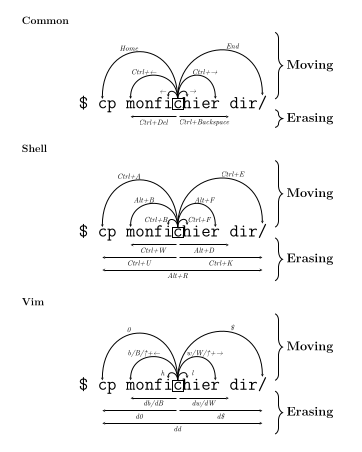

# unix-cheat-sheet

- Common: keyboard shortcuts that usually work everywhere.
- Shell (bash): Explore time-saving keyboard shortcuts for Bash, the Unix shell and command language.
- Vim: Discover essential keyboard shortcuts to enhance your productivity in Vim, the versatile text editor.

## Download PDF Version

To download the PDF version of this cheat sheet:

1. Go to the "Actions" tab of this repository.
2. Look for the workflow named "LaTeX" and click on it.
3. Find the latest workflow run and click on it to view the details.
4. In the "Artifacts" section, you will find the PDF file. Click on "Download" next to the PDF artifact to save it to your device.
